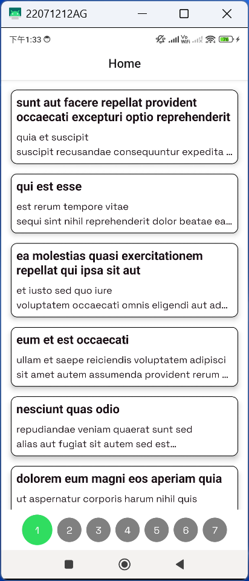
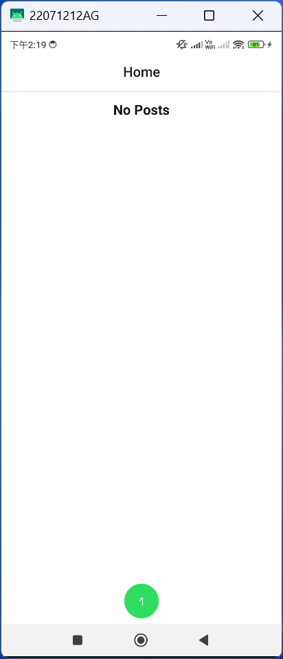
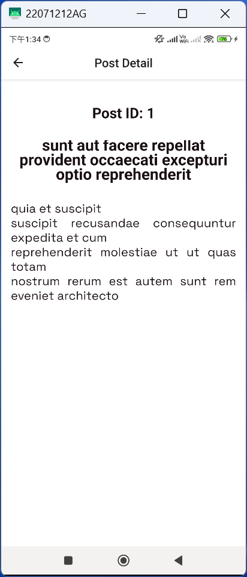
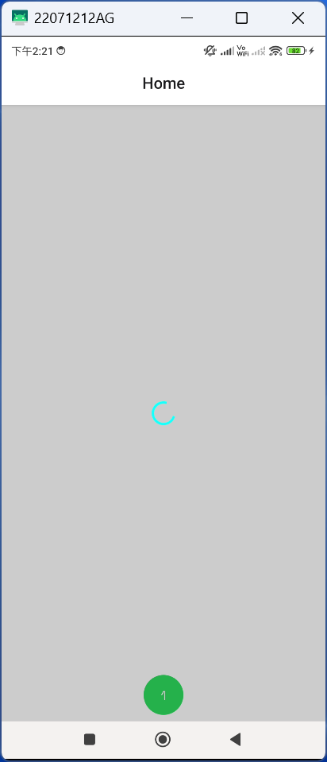
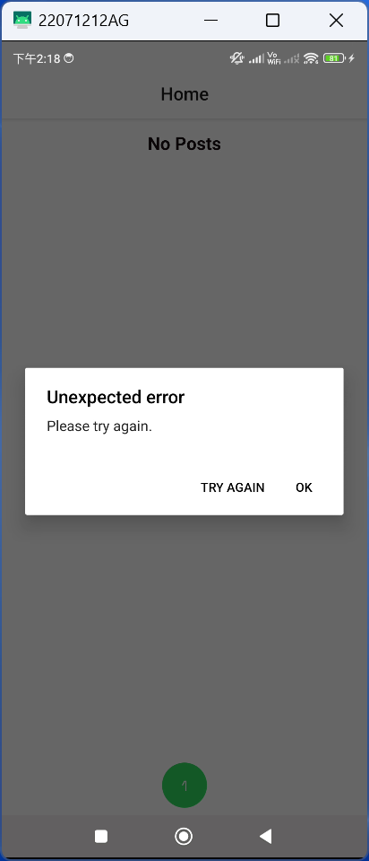

# Contact List App

A contact list app built with React Native, the application is current targeting Android only, if you build IOS, there may be have different in UI.

## Run on iOS/Android

To run the app on iOS or Android device, first need to install the dependencies by `yarn install`, then run commnad according to desired platform.

```
yarn install
yarn ios        // run iOS
yarn android    // run Android
```

## APK File

The apk is located at path others/contact-list-app.apk

#### or

You can get the build from <a href="https://expo.dev/accounts/bendayap/projects/contact-list-app/builds/6b14fbc8-96d3-46c5-9de9-b098b95f31ae" target="_blank">here</a>

## Screenshots

Homescreen:



Empty list:



Post detail screen:



Loading indicator:



Error alert:


